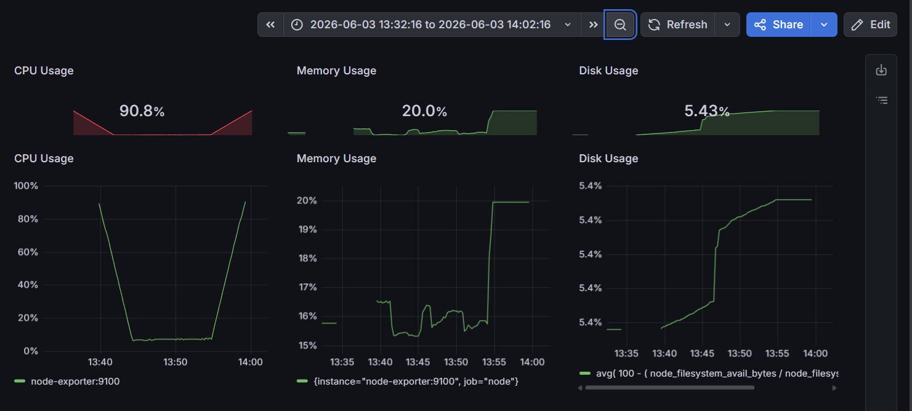
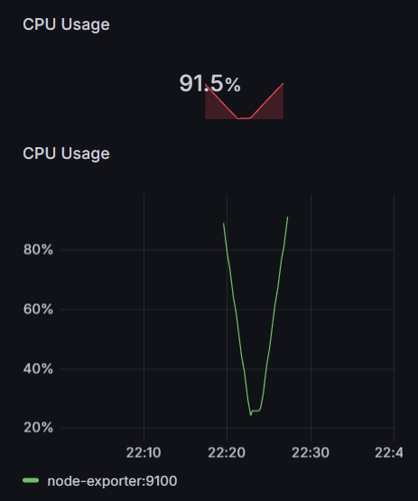
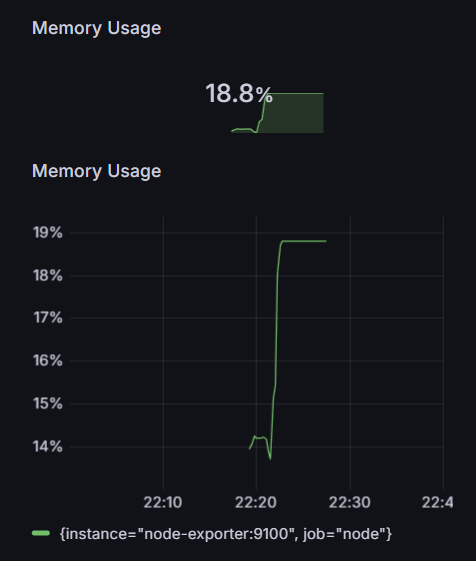

# Monitoring & Observability System

A monitoring and observability solution built using Prometheus, Grafana, Docker, and Node Exporter to monitor system performance metrics such as CPU, memory, and disk utilization.

## Features

* Real-time monitoring of CPU, memory, and disk usage
* Metrics collection using Node Exporter
* Data storage and querying with Prometheus
* Interactive Grafana dashboards
* Alert rules for high CPU and memory utilization
* Persistent Grafana storage using Docker volumes

## Tech Stack

* Docker
* Prometheus
* Grafana
* Node Exporter

## Project Structure

```
monitoring-observability-system
│
├── prometheus
│   ├── prometheus.yml
│   └── alerts.yml
│
├── screenshots
│   ├── dashboard-overview.png
│   ├── cpu-monitoring.png
│   ├── memory-monitoring.png
│   └── alert-monitoring.png
│
├── docker-compose.yml
└── README.md
```

## Setup

### Clone Repository

```bash
git clone https://github.com/suyash-5613/monitoring-observability-system.git
cd monitoring-observability-system
```

### Start Services

```bash
docker compose up -d
```

### Access Applications

Prometheus:

```
http://localhost:9090
```

Grafana:

```
http://localhost:3000
```

## Dashboard Preview

### Infrastructure Monitoring Dashboard



### CPU Monitoring



### Memory Monitoring




## Alerting

The project includes alert rules for:

* High CPU Usage
* High Memory Usage

Prometheus continuously evaluates these rules and generates alerts when thresholds are exceeded.

## Learning Outcomes

Through this project I gained hands-on experience with:

* Prometheus metrics collection and monitoring
* Grafana dashboard creation
* Infrastructure observability concepts
* Docker container management
* Alert configuration and monitoring workflows
* System performance analysis

## Author

Suyash Sahu
